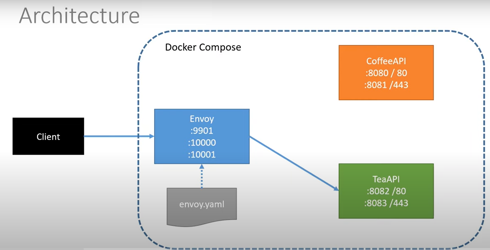
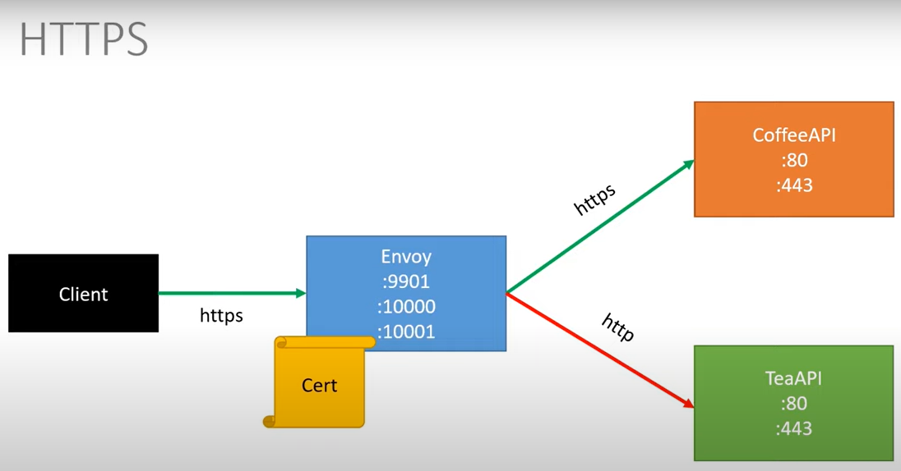

# .NET-6-Envoy-API-Gateway
Envoy as API Gateway for HTTP routing &amp; TLS/HTTPS termination

>[Build an API Gateway with Envoy and use with .NET APIs](https://www.youtube.com/watch?v=UsoH5cqE1OA) by Les Jackson

## Architecture

## HTTPS Diagram
